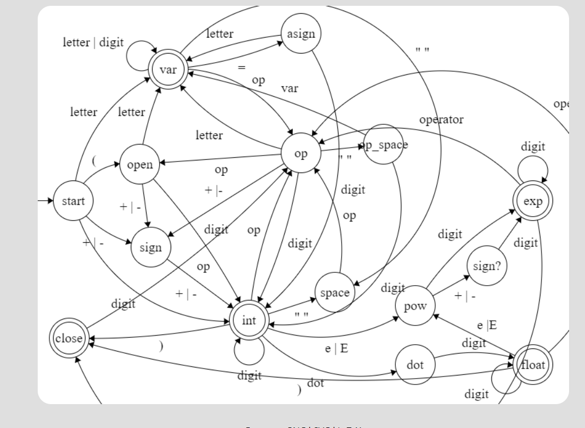

# Actividad 3.2

Para esta avtividad estaremos usando la siguiente tabla de transicion para conocer los cambios de estados que tendremos a la hora de implementar el codigo



Para correr nuetro codigo tendremos que poner lo siguiente en nuetra terminal con el lector de elixr ya inicializado

```bash
Hw.TokenList.arithmetic_lexer("34.12 * -234 * 34.12")
```

Este es uno de los ejemplo que tenemos para implementar en nuetra funcion de arithmetic_lexer. Para cumplir con la regla de los espacios, podemos tener un espacio al final de cualquier numero ya sea entero, flotante o exponencial, seguido de algun operador, y después de un operado podemos tener un espacio que le siga un nuemero,  una variable o un signo. Esto quiere decir que no dará un error si quieremos poner un espacio y después un parentesis abiriendose, parentesis cerrandose o un signo de asignación.